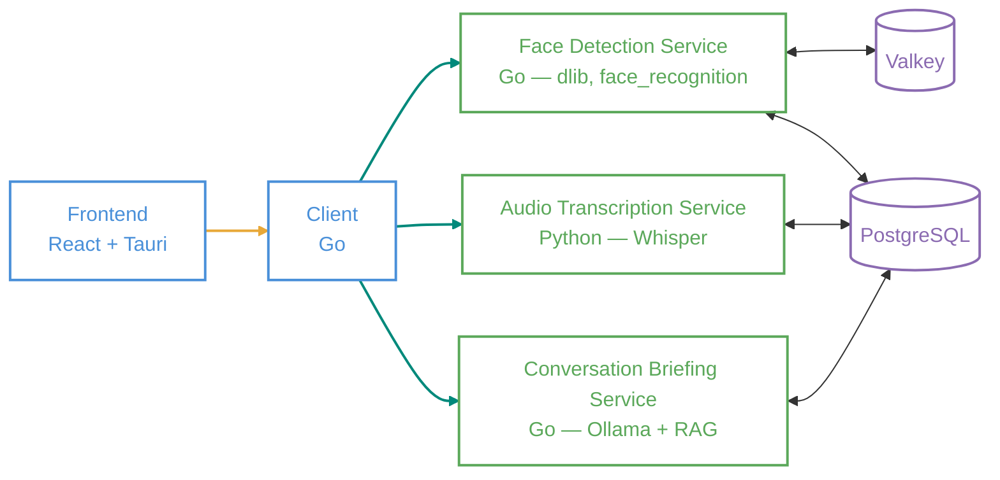

<div align="center">

[](https://github.com/Vchen7629/Mosaic/actions/workflows/ci.yaml)
[](https://codecov.io/gh/Vchen7629/Mosaic)
[](LICENSE)
[](https://go.dev/)
[](https://www.python.org/)

</div>

Mosaic is a desktop application designed to assist people with memory loss. It identifies visitors via webcam and displays an AI-generated briefing about who they are and what you last talked about — so users always have context before a conversation begins. Originally built for HackMerced XI ([Devpost](https://devpost.com/software/mosaic-ulzfj9)).

## How It Works

When a known face appears on webcam, Mosaic shows a personalized card with the visitor's name and a summary of past conversations. Audio is transcribed in real time during the session. When recording stops, the transcript is summarized and stored, updating the briefing for the next visit.

Unknown visitors can be enrolled by name during their first appearance. Over time, the system builds a longitudinal memory of each relationship.

## Architecture

Five gRPC services, each with a distinct responsibility. Go is used throughout except for audio transcription, where Whisper has no practical Go equivalent. Briefings are generated by a self-hosted Qwen model via Ollama.



<sub>Green arrows — gRPC &nbsp;|&nbsp; Orange arrows — WebSocket</sub>

## Services

| Service | Language | Description |
|---|---|---|
| `frontend` | React / Tauri | Captures webcam frames and audio, displays face overlays and briefing cards, streams to client via WebSocket |
| `client` | Go | Receives webcam and audio streams from the frontend, forwards to backend services via gRPC |
| `face_detection` | Go | Identifies faces using dlib embeddings, registers new visitors |
| `audio_transcription` | Python | Transcribes audio in real time using Whisper, persists transcripts |
| `conversation_briefing` | Go | Generates visitor briefings using a self-hosted Qwen model and RAG over conversation history |

## Tech Stack

- **Transport:** gRPC with Protocol Buffers, WebSockets
- **Backend services:** Go 1.24
- **ML services:** Python 3.12 (Whisper), Go (dlib / face_recognition)
- **LLM:** Qwen via Ollama (self-hosted)
- **Vector search:** pgvector with similarity search
- **Databases:** PostgreSQL, Valkey
- **Desktop shell:** Tauri

## Local Development

Each service has its own build tooling. From the repo root:

**Audio Transcription (Python)**
```bash
cd backend/audio_transcription
uv sync --locked --all-extras --dev
make test_all
```

**Client / Conversation Briefing / Face Detection (Go)**
```bash
cd backend/<service>
go mod download
make test_all
```

**Frontend**
```bash
cd frontend
npm install
npm run dev
```

Proto definitions live in `backend/proto/`. Re-generate bindings with:
```bash
cd backend/proto
make generate
```